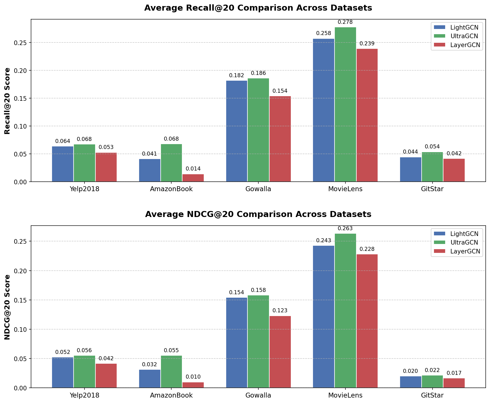

# Recommendation System with Implicit Feedback  

### CSC14114 — Big Data Applications Course Project  
University of Science — VNUHCM

This project studies, implements, and evaluates **state-of-the-art recommender system models** for **Top-K recommendation with implicit feedback** across multiple benchmark datasets and a large-scale self-collected dataset.

The goal is to analyze how modern recommendation models behave under different dataset characteristics while ensuring fair and reproducible evaluation.

---

## 📌 Problem Statement

Most real-world platforms (e-commerce, streaming, social media) rely on **implicit feedback** such as clicks, views, purchases instead of explicit ratings.

This project focuses on:

- Implicit feedback represented as **binary interactions (0/1)**
- **Top-K recommendation** task
- Fair evaluation using ranking metrics
- Comparing **3 SOTA models** across **5 datasets**

---

## 🧠 Selected SOTA Models

The following state-of-the-art models were selected based on:

- Frequent appearance in recent surveys
- Strong performance in literature
- Publicly available source code
- Focused deep experiment on Graph-based models

> Detailed explanation is provided in the report.

---

## 📊 Datasets

Experiments are conducted on **4 benchmark datasets** and **1 self-collected dataset**.

### Collected Dataset Pipeline

`Data Source → Crawling → Cleaning → Normalization → Interaction Matrix`

Steps performed:

- Remove duplicates
- Normalize user/item IDs
- Timestamp standardization
- Convert to implicit feedback format (0/1)

---

## 🧪 Evaluation Protocol

To ensure fair comparison, we strictly follow a consistent evaluation protocol:

- Train / Test split by timestamp
- Leave-one-out strategy for testing
- Candidate sampling for ranking
- Each experiment runs **3–5 times** and reports **average result**

### Metrics

We evaluate using ranking metrics:

**Correctness**
- Recall@K
  
**Ranking Quality**
- NDCG@K

---

## ⚙️ Experimental Setup

- Total experiments: **3 models × 5 datasets = 15 experiments**
- Each experiment repeated 3 times
- Training time, RAM, VRAM, and convergence are recorded
- Results are averaged for reporting

---

## 📈 Results Comparison

Performance comparison across datasets is presented in the report with analysis of:

- Dataset characteristics impact
- Strengths and weaknesses of each model
- Resource consumption vs performance trade-off

---
